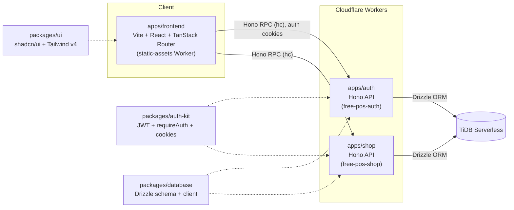

# Free POS

An open-source, free point-of-sale system for restaurants and cafes — built as a portfolio project to demonstrate a production-shaped Cloudflare Workers monorepo (typed RPC, real integration tests, CI/CD).

[](https://github.com/has-bii/free-pos/actions/workflows/ci.yml)


> **Status: early-stage / work in progress.** Authentication, the shop service, and initial shop onboarding are functional; the core POS features (menus, orders, tables, checkout) are still being built. See [Roadmap](#roadmap) below.

## Architecture

A Turborepo/pnpm monorepo. `apps/frontend` is a client-side SPA that talks to `apps/auth` and `apps/shop`, Cloudflare Workers services, over Hono's typed RPC client — so API calls are type-checked end-to-end with no shared schema package. Authentication uses `httpOnly` cookies, while the shop service provides public directory access and authenticated owner operations. Both services persist through `packages/database` (Drizzle ORM over TiDB Serverless); JWT signing/verification and auth middleware live in `packages/auth-kit` so services can share the same access-token contract without reimplementing auth.



**Apps**
- `apps/auth` — Hono API on Cloudflare Workers. Email/password and Google OAuth authentication (register, login, password recovery, refresh, `/me`), with HS256 JWTs delivered as `httpOnly` cookies.
- `apps/shop` — Hono API on Cloudflare Workers. Public shop directory routes plus authenticated owner CRUD for shops, sharing the database and access-token secret with `apps/auth`.
- `apps/frontend` — Vite + React 19 + TanStack Router SPA with authentication and shop onboarding, deployed as a static-assets Worker. No SSR, no server component.

**Shared packages**
- `packages/auth-kit` — JWT signing/verification, `requireAuth` middleware, cookie helpers.
- `packages/database` — Drizzle ORM schema/client over TiDB Serverless.
- `packages/ui` — shared shadcn/ui component library, Tailwind v4 theme.
- `packages/typescript-config` — shared `tsconfig` bases (strict mode, `noUncheckedIndexedAccess`, etc.).

## Roadmap

- [x] Email/password and Google OAuth auth (register, login, password recovery, refresh, `/me`) with HS256 JWTs in `httpOnly` cookies
- [x] Login and registration page UI (`apps/frontend`)
- [x] Shop service with public directory and owner-scoped CRUD
- [x] Shop onboarding flow (`apps/frontend`)
- [ ] Menu & item management
- [ ] Table management
- [ ] Order taking / kitchen tickets
- [ ] Checkout & payments
- [ ] Sales reporting

## Documentation

- [Backend application conventions](./docs/conventions/backend.md) — structure and layering rules for backend apps.
- [`CLAUDE.md`](./CLAUDE.md) — repository architecture, commands, and contribution guidance.
- [`apps/auth/CLAUDE.md`](./apps/auth/CLAUDE.md) — authentication service setup, architecture, and testing.
- [`apps/shop/CLAUDE.md`](./apps/shop/CLAUDE.md) — shop service setup, routes, authentication, and testing.

## Getting Started

Requires Node (see `.nvmrc`) and pnpm.

```bash
pnpm install
pnpm dev
```

This runs every app in dev mode via Turborepo (`apps/auth` on `wrangler dev`, `apps/shop` on `wrangler dev`, and `apps/frontend` on Vite). Each app and package needs its own local env setup (database connection string, JWT secret, frontend origin, etc.) before `dev`/`test` will work — see the `CLAUDE.md` files in `apps/auth`, `apps/shop`, `apps/frontend`, and `packages/database` for exact steps.

Other root-level commands (see [`CLAUDE.md`](./CLAUDE.md) for the full list):

```bash
pnpm build       # turbo run build
pnpm lint        # turbo run lint (biome)
pnpm typecheck   # turbo run typecheck
pnpm test        # turbo run test
```

## Deployment

Pushing to the `production` branch runs [`.github/workflows/deploy.yml`](./.github/workflows/deploy.yml). The workflow applies pending database migrations, deploys `apps/auth` and `apps/shop` as Cloudflare Workers, and builds and deploys `apps/frontend` as a static-assets Worker. Production Worker bindings and GitHub Actions secrets are configured outside the repository; see the app-specific `CLAUDE.md` files for the required values.

## License

[MIT](./LICENSE)
