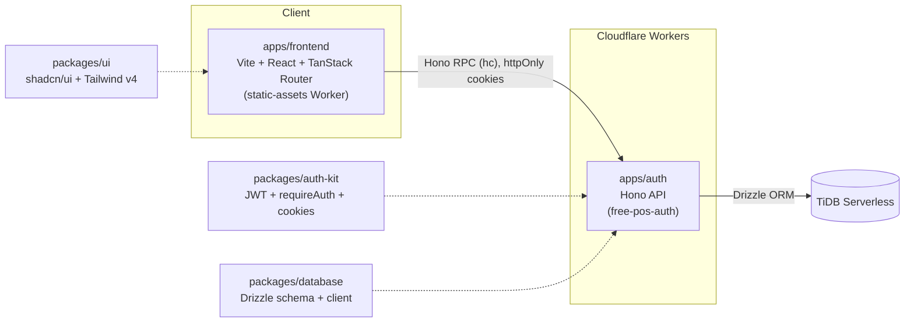

# Free POS

An open-source, free point-of-sale system for restaurants and cafes — built as a portfolio project to demonstrate a production-shaped Cloudflare Workers monorepo (typed RPC, real integration tests, CI/CD).

[](https://github.com/has-bii/free-pos/actions/workflows/ci.yml)


> **Status: early-stage / work in progress.** Auth is functional; the actual POS features (menus, orders, tables, checkout) haven't been built yet. See [Roadmap](#roadmap) below.

## Architecture

A Turborepo/pnpm monorepo. `apps/frontend` is a client-side SPA that talks to `apps/auth`, a Cloudflare Workers service, over Hono's typed RPC client — so API calls are type-checked end-to-end with no shared schema package. `apps/auth` persists through `packages/database` (Drizzle ORM over TiDB Serverless); JWT signing/verification and auth middleware live in `packages/auth-kit` so any future service can reuse them without depending on `apps/auth` itself.



**Apps**
- `apps/auth` — Hono API on Cloudflare Workers. Email/password auth (register, login, refresh, `/me`), HS256 JWTs delivered as `httpOnly` cookies.
- `apps/frontend` — Vite + React 19 + TanStack Router SPA, deployed as a static-assets Worker. No SSR, no server component.

**Shared packages**
- `packages/auth-kit` — JWT signing/verification, `requireAuth` middleware, cookie helpers.
- `packages/database` — Drizzle ORM schema/client over TiDB Serverless.
- `packages/ui` — shared shadcn/ui component library, Tailwind v4 theme.
- `packages/typescript-config` — shared `tsconfig` bases (strict mode, `noUncheckedIndexedAccess`, etc.).

## Roadmap

- [x] Email/password auth (register, login, refresh, `/me`) with HS256 JWTs in `httpOnly` cookies
- [x] Login page UI (`apps/frontend`)
- [ ] Menu & item management
- [ ] Table management
- [ ] Order taking / kitchen tickets
- [ ] Checkout & payments
- [ ] Sales reporting

## Getting Started

Requires Node (see `.nvmrc`) and pnpm.

```bash
pnpm install
pnpm dev
```

This runs every app in dev mode via Turborepo (`apps/auth` on `wrangler dev`, `apps/frontend` on Vite). Each app and package needs its own local env setup (database connection string, JWT secret, etc.) before `dev`/`test` will work — see the `CLAUDE.md` in each of `apps/auth`, `apps/frontend`, and `packages/database` for exact steps.

Other root-level commands (see [`CLAUDE.md`](./CLAUDE.md) for the full list):

```bash
pnpm build       # turbo run build
pnpm lint        # turbo run lint (biome)
pnpm typecheck   # turbo run typecheck
pnpm test        # turbo run test
```

## License

[MIT](./LICENSE)
